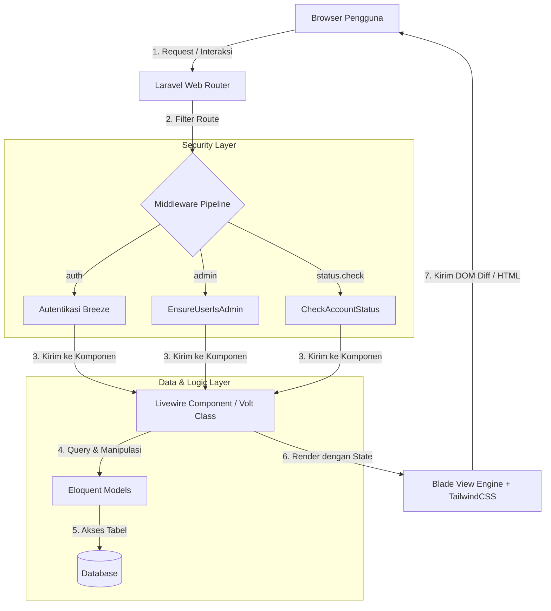
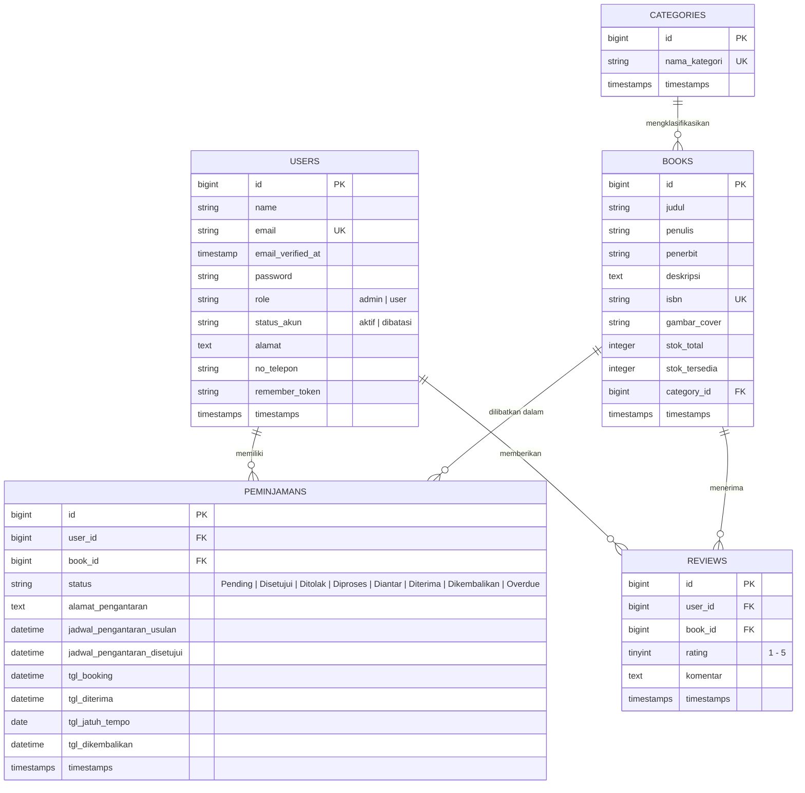
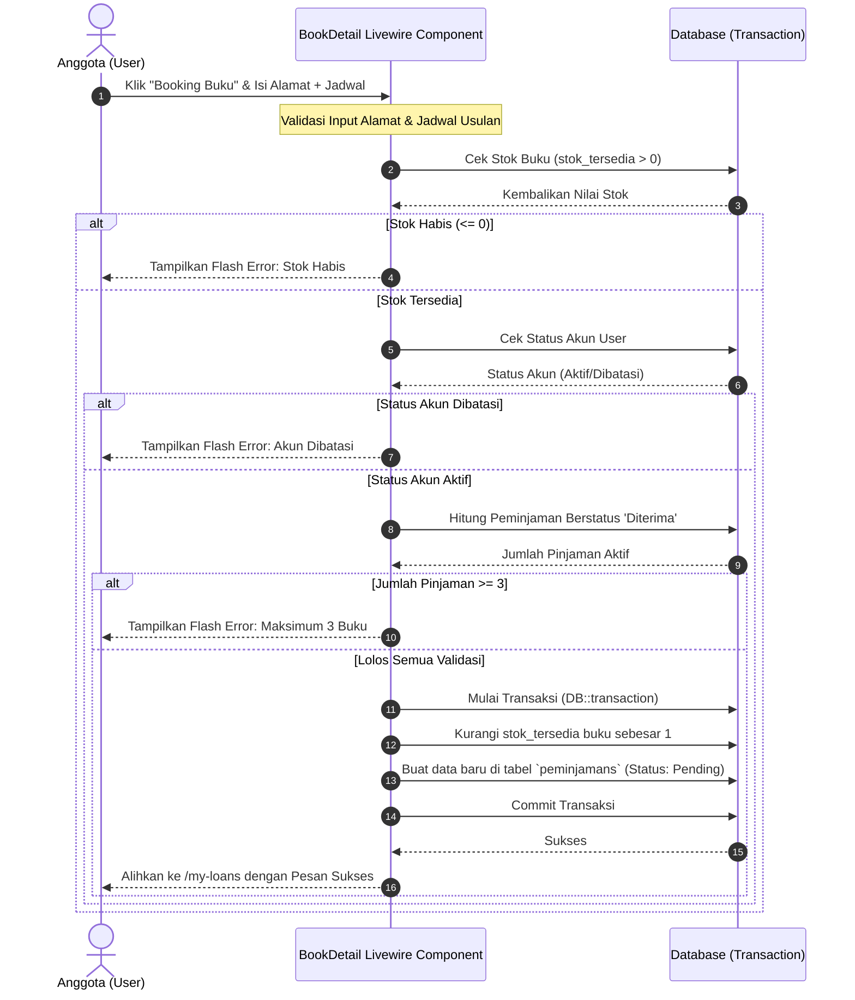
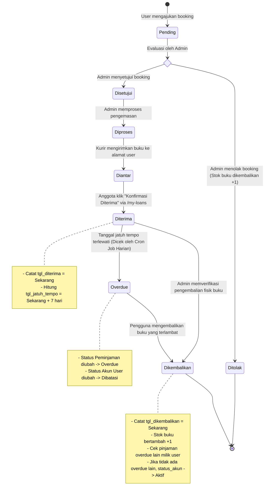
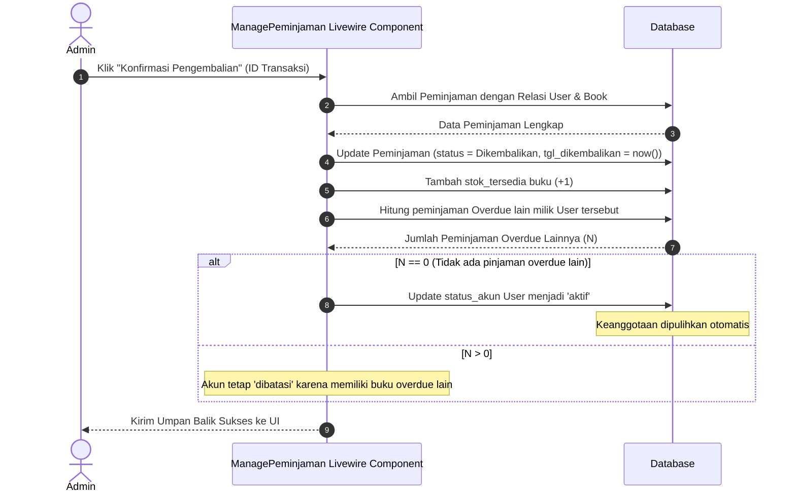
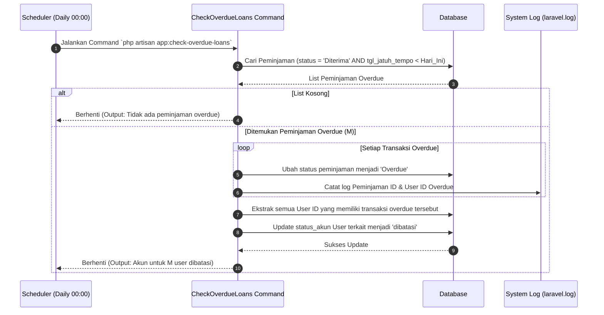

# Software Architecture Specification (SAS)
## Mercusuar Library System

Dokumen *Software Architecture Specification* (SAS) ini memberikan deskripsi arsitektural tingkat tinggi mengenai sistem perpustakaan digital **Mercusuar Library**. Dokumen ini dirancang untuk menjelaskan struktur arsitektur sistem, skema database, kontrol keamanan, serta alur proses bisnis utama secara mendalam.

---

## 1. Tinjauan Umum Sistem

**Mercusuar Library** adalah sistem manajemen perpustakaan digital terintegrasi yang memudahkan pengguna untuk mencari buku, membaca ulasan, melakukan peminjaman/booking secara online dengan sistem pengantaran fisik, serta menulis ulasan. Sistem juga menyediakan panel administrasi komprehensif bagi pustakawan (Admin) untuk mengelola data buku, kategori, transaksi peminjaman, dan status keanggotaan.

Aplikasi ini dibangun menggunakan arsitektur modern berbasis framework PHP **Laravel 11** dan **Laravel Livewire v3**. Kombinasi ini menghasilkan aplikasi web SPA (*Single Page Application*) reaktif yang efisien, tanpa memerlukan penulisan API RESTful terpisah atau framework JavaScript sisi klien yang rumit seperti Vue atau React.

---

## 2. Arsitektur Tingkat Tinggi (High-Level Architecture)

Sistem menggunakan pola arsitektur **Model-View-Controller (MVC)** yang disempurnakan oleh konsep **Livewire Component-State Driven**. Di bawah ini adalah gambaran alur komponen dan request lifecycle pada sistem Mercusuar Library:

### Keterangan Arsitektur:
1. **Client/Browser**: Melakukan pengiriman HTTP request atau interaksi AJAX tersembunyi yang digenerate oleh Livewire Javascript Assets.
2. **Laravel Router**: Menentukan rute web (misalnya `/dashboard` atau `/admin/transactions`) dan mengarahkan ke komponen Livewire yang tepat.
3. **Middleware Pipeline**:
   - `auth`: Memastikan pengguna telah masuk log.
   - `admin`: Membatasi akses rute administratif khusus untuk admin.
   - `status.check`: Memeriksa apakah akun pengguna sedang dibatasi (status `dibatasi`). Jika ya, request diblokir dengan kode HTTP 403.
4. **Livewire Component & Volt**: Mengontrol logika bisnis, validasi masukan, state properties, dan berkomunikasi dengan Eloquent Model.
5. **Eloquent Model**: Mengabstraksikan struktur database menjadi objek PHP yang mudah dikueri.
6. **Blade View + TailwindCSS**: Merender struktur antarmuka secara dinamis berdasarkan state terbaru dari komponen Livewire.

---

## 3. Skema Database & Entity-Relationship Diagram (ERD)

Sistem ini didukung oleh database relasional yang terdiri dari lima entitas utama: `users`, `books`, `categories`, `peminjamans`, dan `reviews`.

### Diagram Hubungan Entitas (ERD)

### Relasi & Aturan Database (Database Constraints):
1. **`users` -> `peminjamans`**: Relasi `One-to-Many` (Satu user memiliki banyak peminjaman). Penghapusan user dibatasi (`onDelete('restrict')`) jika user tersebut masih memiliki riwayat peminjaman untuk menjaga integritas data transaksi.
2. **`books` -> `peminjamans`**: Relasi `One-to-Many`. Penghapusan buku dibatasi (`onDelete('restrict')`) jika buku terkait sedang dalam status dipinjam atau terdapat dalam catatan peminjaman.
3. **`categories` -> `books`**: Relasi `One-to-Many`. Jika kategori dihapus, kolom `category_id` pada buku yang bersangkutan diatur menjadi kosong (`onDelete('set null')`).
4. **`reviews`**: Terikat ke `users` dan `books` dengan relasi cascade (`onDelete('cascade')`). Jika buku atau user dihapus, ulasan terkait otomatis terhapus.

---

## 4. Keamanan & Kontrol Akses (Security & Access Control)

Sistem menerapkan prinsip *Least Privilege* (hak istimewa minimum) melalui kombinasi otentikasi berbasis peran (Role-Based Access Control) dan validasi status akun:

### 4.1 Peran Pengguna (Roles)
Didefinisikan dalam `App\Enums\Role`:
- **`admin`**: Memiliki hak akses penuh untuk melakukan operasi CRUD data buku, manajemen kategori, verifikasi transaksi (penerimaan, pengiriman, pengembalian), serta pengubahan status dan peran user lain.
- **`user`**: Anggota perpustakaan yang hanya dapat menjelajahi katalog buku, mengajukan peminjaman (booking), mengonfirmasi penerimaan buku di alamatnya, dan menulis ulasan untuk buku yang telah sukses dikembalikannya.

### 4.2 Status Akun (Account Status)
Didefinisikan dalam `App\Enums\StatusAkun`:
- **`aktif`**: Status default keanggotaan. User diizinkan melakukan pencarian dan pengajuan peminjaman buku baru.
- **`dibatasi`**: Akun pengguna dibatasi karena memiliki keterlambatan pengembalian buku (status transaksi `Overdue`). Pengguna dengan status ini **tidak diizinkan** melakukan peminjaman buku baru dan seluruh rute non-publik mereka diblokir oleh middleware `CheckAccountStatus` (HTTP 403).

### 4.3 Pipa Perlindungan Middleware (Middleware Pipeline)
Rute-rute aplikasi dilindungi oleh filter middleware berikut:
- **`auth`**: Memastikan user sudah login.
- **`admin` (`EnsureUserIsAdmin`)**:
  - Mengecek `$request->user()->role === Role::Admin`.
  - Jika bukan admin, mengalihkan ke `/dashboard` dengan pesan error "Anda tidak memiliki hak akses admin."
- **`status.check` (`CheckAccountStatus`)**:
  - Mengecek `$request->user()->status_akun !== StatusAkun::Aktif`.
  - Jika akun dibatasi, menghentikan request dengan respons `abort(403, 'Akun Anda sedang DIBATASI...')`.

---

## 5. Alur & Diagram Sekuens Utama (Key System Flows)

### 5.1 Alur Booking Buku (Peminjaman Baru)
Alur ini memastikan pengguna berstatus aktif meminjam buku yang tersedia secara aman menggunakan mekanisme transaksi database guna mencegah *race conditions* pada stok buku.

---

### 5.2 Alur Pengiriman & Penerimaan Buku
Berikut adalah siklus perubahan status peminjaman dari pertama kali diajukan hingga diterima secara fisik oleh pengguna:

---

### 5.3 Alur Konfirmasi Pengembalian Buku & Pemulihan Akun
Ketika buku dikembalikan secara fisik ke perpustakaan, pustakawan (Admin) memicu proses pengembalian yang secara otomatis memperbarui stok dan mengevaluasi status akun anggota:

---

### 5.4 Alur Pengecekan Keterlambatan Otomatis (Cron Job/Scheduler)
Sistem memiliki mekanisme penegakan aturan otomatis untuk melacak peminjaman yang terlambat dikembalikan. Tugas terjadwal (*scheduled task*) berjalan setiap hari:

---
*Dokumen ini merupakan bagian dari spesifikasi teknis Mercusuar Library. Segala perubahan desain arsitektural wajib didokumentasikan dan disetujui oleh tim pengembang.*
