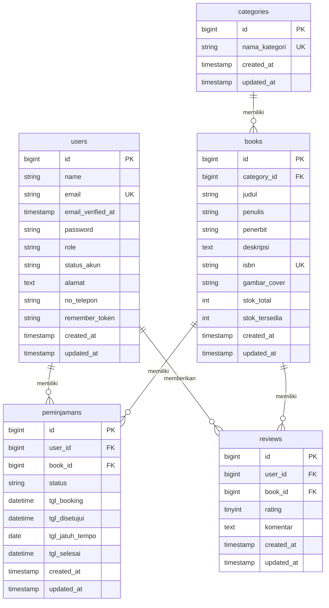

# Software Design Description (SDD)
## Mercusuar Library System

Dokumen *Software Design Description* (SDD) ini memberikan penjelasan rinci mengenai arsitektur kode, dekomposisi modul, spesifikasi komponen, struktur data, dan desain antarmuka dari sistem **Mercusuar Library**.

---

## 1. Dekomposisi Modul & Komponen Fisik

Aplikasi Mercusuar Library didekomposisi ke dalam beberapa modul utama berdasarkan peran dan fungsinya dalam pola kerja Laravel:

### 1.1 Struktur Direktori & File Kunci
Berikut adalah pemetaan fisik komponen utama sistem beserta pranala langsung ke kodenya:

- **Enums (Enumerator)**
  - [Role.php](file:///c:/laragon/www/mercusuar-library/app/Enums/Role.php): Menyimpan definisi peran pengguna (`admin` dan `user`).
  - [StatusAkun.php](file:///c:/laragon/www/mercusuar-library/app/Enums/StatusAkun.php): Definisi status keanggotaan (`aktif` dan `dibatasi`).
  - [StatusPeminjaman.php](file:///c:/laragon/www/mercusuar-library/app/Enums/StatusPeminjaman.php): Status siklus peminjaman buku (8 status).

- **Models (Database Abstraction & Relasi)**
  - [User.php](file:///c:/laragon/www/mercusuar-library/app/Models/User.php): Entitas pengguna dengan cast role/status akun dan relasi peminjaman/review.
  - [Book.php](file:///c:/laragon/www/mercusuar-library/app/Models/Book.php): Entitas buku dengan relasi kategori, peminjaman, dan review.
  - [Category.php](file:///c:/laragon/www/mercusuar-library/app/Models/Category.php): Entitas klasifikasi buku.
  - [Peminjaman.php](file:///c:/laragon/www/mercusuar-library/app/Models/Peminjaman.php): Entitas pencatatan transaksi peminjaman lengkap dengan cast status dan tipe tanggal.
  - [Review.php](file:///c:/laragon/www/mercusuar-library/app/Models/Review.php): Entitas ulasan dan rating buku oleh anggota.

- **Middlewares (Security Pipeline)**
  - [EnsureUserIsAdmin.php](file:///c:/laragon/www/mercusuar-library/app/Http/Middleware/EnsureUserIsAdmin.php): Membatasi akses khusus pengguna ber-role `admin`.
  - [CheckAccountStatus.php](file:///c:/laragon/www/mercusuar-library/app/Http/Middleware/CheckAccountStatus.php): Memblokir pengguna dengan status akun `dibatasi`.

- **Console Commands (Scheduled CLI Tasks)**
  - [CheckOverdueLoans.php](file:///c:/laragon/www/mercusuar-library/app/Console/Commands/CheckOverdueLoans.php): CLI Command untuk melacak keterlambatan pengembalian buku secara otomatis.

- **Livewire Components (Logic & State Controller)**
  - **Admin Module**:
    - [Dashboard.php](file:///c:/laragon/www/mercusuar-library/app/Livewire/Admin/Dashboard.php): Logika dashboard metrik admin.
    - [ListBooks.php](file:///c:/laragon/www/mercusuar-library/app/Livewire/Admin/Books/ListBooks.php): Pengelolaan buku (CRUD + Cover Upload).
    - [ManagePeminjaman.php](file:///c:/laragon/www/mercusuar-library/app/Livewire/Admin/Transactions/ManagePeminjaman.php): Manajemen alur peminjaman buku.
    - [ListUsers.php](file:///c:/laragon/www/mercusuar-library/app/Livewire/Admin/Users/ListUsers.php): Pengelolaan status akun dan role anggota.
  - **Frontend/Katalog Module**:
    - [BookCatalog.php](file:///c:/laragon/www/mercusuar-library/app/Livewire/Katalog/BookCatalog.php): Grid penjelajahan katalog buku dengan pencarian & kategori filter.
    - [BookDetail.php](file:///c:/laragon/www/mercusuar-library/app/Livewire/Katalog/BookDetail.php): Halaman detail buku, ulasan, rating, dan form booking.
  - **User Dashboard Module**:
    - [MyLoans.php](file:///c:/laragon/www/mercusuar-library/app/Livewire/User/MyLoans.php): Manajemen riwayat peminjaman mandiri anggota.

---

## 2. Spesifikasi Detail Komponen

### 2.1 Enumerator (Enums)
Enumerasi digunakan untuk memastikan keamanan data (*type-safety*) pada level database dan kode aplikasi.

#### `App\Enums\Role`
- Tipe data: `string`
- Kasus:
  - `Admin` = `'admin'`
  - `User` = `'user'`
  - `KepalaPerpus` = `'kepala_perpus'`

#### `App\Enums\StatusAkun`
- Tipe data: `string`
- Kasus:
  - `Aktif` = `'aktif'`
  - `Dibatasi` = `'dibatasi'`

#### `App\Enums\StatusPeminjaman`
- Tipe data: `string`
- Kasus:
  - `Pinjam` = `'Pinjam'` (Menunggu persetujuan)
  - `Disetujui` = `'Disetujui'` (Disetujui, siap diambil)
  - `Ditolak` = `'Ditolak'` (Pengajuan ditolak)
  - `Selesai` = `'Selesai'` (Buku telah dikembalikan)
  - `Overdue` = `'Overdue'` (Buku terlambat dikembalikan)

---

### 2.2 Models

#### `App\Models\User`
- **Atribut mass assignable**: `name`, `email`, `password`, `role`, `status_akun`, `alamat`, `no_telepon`.
- **Casting Atribut**:
  - `role` => `App\Enums\Role`
  - `status_akun` => `App\Enums\StatusAkun`
  - `email_verified_at` => `datetime`
- **Relasi**:
  - `peminjamans()` => `HasMany` ke [Peminjaman.php](file:///c:/laragon/www/mercusuar-library/app/Models/Peminjaman.php)
  - `reviews()` => `HasMany` ke [Review.php](file:///c:/laragon/www/mercusuar-library/app/Models/Review.php)

#### `App\Models\Book`
- **Atribut guarded**: `id` (mengizinkan mass assignment untuk properti lainnya).
- **Relasi**:
  - `category()` => `BelongsTo` ke [Category.php](file:///c:/laragon/www/mercusuar-library/app/Models/Category.php)
  - `peminjamans()` => `HasMany` ke [Peminjaman.php](file:///c:/laragon/www/mercusuar-library/app/Models/Peminjaman.php)
  - `reviews()` => `HasMany` ke [Review.php](file:///c:/laragon/www/mercusuar-library/app/Models/Review.php)

#### `App\Models\Peminjaman`
- **Atribut guarded**: `id`.
- **Casting Atribut**:
  - `status` => `App\Enums\StatusPeminjaman`
  - `jadwal_pengantaran_usulan` => `datetime`
  - `jadwal_pengantaran_disetujui` => `datetime`
  - `tgl_booking` => `datetime`
  - `tgl_diterima` => `datetime`
  - `tgl_jatuh_tempo` => `date`
  - `tgl_dikembalikan` => `datetime`
- **Relasi**:
  - `user()` => `BelongsTo` ke [User.php](file:///c:/laragon/www/mercusuar-library/app/Models/User.php)
  - `book()` => `BelongsTo` ke [Book.php](file:///c:/laragon/www/mercusuar-library/app/Models/Book.php)

---

### 2.3 Komponen Livewire Sisi Anggota (Frontend)

#### `App\Livewire\Katalog\BookCatalog`
Komponen ini mengontrol antarmuka pencarian buku secara interaktif.
- **Properti reaktif**:
  - `$search` (string): Kata kunci pencarian judul, penulis, atau ISBN.
  - `$selectedCategory` (string): ID kategori terpilih untuk filter buku.
- **Siklus Hidup (Lifecycle hooks)**:
  - `updatingSearch()`, `updatingSelectedCategory()`: Memanggil `$this->resetPage()` agar paginasi kembali ke halaman 1 ketika kriteria pencarian berubah.
- **Metode `render()`**:
  - Melakukan query buku dengan teknik *Eager Loading* `with('category')`.
  - Memanfaatkan klausa `when()` untuk menyaring hasil pencarian dan kategori secara bersyarat.
  - Menampilkan hasil dalam paginasi 12 item per halaman.

#### `App\Livewire\Katalog\BookDetail`
Komponen ini menangani detail buku, pengajuan pinjaman (booking), dan pemberian ulasan.
- **Properti Reaktif**:
  - `$alamat_pengantaran` (string): Alamat pengiriman buku (default diisi dari profil user).
  - `$usulan_jadwal` (string|null): Opsi pengusulan tanggal/jam pengantaran buku.
  - `$newReviewRating` (int): Nilai rating ulasan (1-5, default: 5).
  - `$newReviewComment` (string): Komentar ulasan buku.
  - `$sudahPernahPinjam` (bool): Flag status riwayat peminjaman user untuk buku ini.
  - `$sudahReview` (bool): Flag apakah user sudah memberikan ulasan untuk buku ini.
- **Logika Utama `bookNow()` (Booking Buku)**:
  - Validasi form input: `alamat_pengantaran` wajib diisi (minimal 10 karakter, maksimal 1000).
  - **Aturan Peminjaman**:
    1. Memastikan `$book->stok_tersedia > 0`.
    2. Memastikan status akun pengguna saat ini adalah `aktif`.
    3. Memeriksa jumlah pinjaman berstatus `Diterima` milik user tidak melebihi atau sama dengan 3.
    4. Memastikan user tidak memiliki peminjaman aktif lainnya untuk buku yang sama (status `Pending`, `Disetujui`, `Diproses`, `Diantar`, atau `Diterima`).
  - **Mekanisme DB**: Dijalankan di dalam `DB::transaction()` untuk mendepresiasi `stok_tersedia` buku sebanyak 1 unit dan membuat record `Peminjaman` dengan status `Pending`.
- **Logika Utama `addReview()` (Tambah Ulasan)**:
  - Validasi: Rating wajib 1-5, Komentar minimal 5 karakter.
  - Verifikasi mandiri: Memeriksa apakah user benar-benar telah menyelesaikan peminjaman buku ini (status `Dikembalikan`) dan belum memberikan review sebelumnya (`$sudahPernahPinjam && !$sudahReview`).

#### `App\Livewire\User\MyLoans`
Menyajikan daftar riwayat transaksi pengguna saat ini.
- **Metode Utama `confirmReceipt($id)` (Konfirmasi Terima Buku)**:
  - Mengambil transaksi terkait berdasarkan ID transaksi dan ID pengguna saat ini.
  - Menguji kelayakan: transaksi harus dalam status `Diantar` (Buku dalam perjalanan oleh kurir).
  - Melakukan perubahan status:
    1. Status diubah menjadi `Diterima`.
    2. Tanggal diterima (`tgl_diterima`) dicatat dengan waktu sistem saat ini (`now()`).
    3. Tanggal jatuh tempo pengembalian (`tgl_jatuh_tempo`) dihitung secara otomatis dengan menambahkan 7 hari (`Carbon::now()->addDays(7)`).

---

### 2.4 Komponen Livewire Sisi Admin (Backoffice)

#### `App\Livewire\Admin\Dashboard`
Menyediakan ringkasan eksekutif statistik perpustakaan.
- **Properti Metrik**:
  - `$pendingLoans` (int): Jumlah peminjaman baru yang menunggu verifikasi.
  - `$jumlahBuku` (int): Total judul buku unik di perpustakaan.
  - `$jumlahUserAktif` (int): Jumlah anggota yang berstatus aktif.
  - `$jumlahOverdue` (int): Jumlah peminjaman yang saat ini terlambat dikembalikan.
- **Metode `mount()`**: Membaca metrik secara langsung menggunakan kueri agregat Eloquent model (`count()`) saat komponen pertama kali di-load.

#### `App\Livewire\Admin\Books\ListBooks`
Mengelola seluruh inventaris data buku di perpustakaan.
- **Validasi Form Atribut**:
  - `judul` => `required|string|max:255`
  - `category_id` => `required|exists:categories,id`
  - `isbn` => `nullable|string|max:25|unique:books,isbn` (kecuali untuk ID buku yang sedang diedit)
  - `stok_total` => `required|integer|min:0`
  - `gambar_cover_baru` => `nullable|image|max:2048` (maksimum file gambar 2MB)
- **Metode `save()` (Simpan & Update)**:
  - Jika merupakan buku baru, `stok_tersedia` diisi sama dengan `stok_total`.
  - Mengelola file upload: Gambar cover baru disimpan di disk `public` direktori `covers/`. Jika memperbarui gambar pada buku lama, gambar cover lama dihapus secara fisik menggunakan fasad `Storage::disk('public')->delete()`.
- **Metode `delete($id)` (Hapus Buku)**:
  - Menghapus gambar fisik terkait jika ada.
  - Dilengkapi blok `try-catch` spesifik menangkap `QueryException` (kesalahan integritas database). Jika buku masih dikaitkan dengan transaksi peminjaman (Error Code 23000), sistem menangkap error tersebut dan menampilkan pesan kesalahan ramah pengguna, mencegah crash sistem.

#### `App\Livewire\Admin\Transactions\ManagePeminjaman`
Mengelola transisi status transaksi seluruh peminjaman di sistem.
- **Filter Tab**: Membaca semua kasus enumerasi `StatusPeminjaman::cases()` dan menampilkannya sebagai opsi filter reaktif di atas tabel.
- **Metode Transisi Status**:
  1. `approve($id)`: Mengubah status transaksi menjadi `Disetujui`.
  2. `reject($id)`: Mengubah status menjadi `Ditolak` dan mengembalikan ketersediaan stok buku terkait (`book->increment('stok_tersedia')`).
  3. `markAsDelivered($id)`: Mengubah status menjadi `Diantar` (kurir siap jalan).
  4. `confirmReturn($id)`:
     - Mengubah status transaksi menjadi `Dikembalikan` dan mencatat `tgl_dikembalikan = now()`.
     - Mengembalikan stok buku tersedia (`book->increment('stok_tersedia')`).
     - **Pemeriksaan Akun Anggota**: Memeriksa apakah pengguna tersebut memiliki peminjaman aktif lain berstatus `Overdue`. Jika **tidak ada**, status akun pengguna otomatis dikembalikan menjadi `aktif` (menghapus pembatasan akun).

#### `App\Livewire\Admin\Users\ListUsers`
Mengatur peranan (Role) dan pembatasan hak anggota.
- **Fitur**: Pencarian nama/email dan filter berdasarkan role (`admin` atau `user`).
- **Metode `updateRole($userId, $newRole)` & `updateStatus($userId, $newStatus)`**:
  - **Pencegahan Kritis**: Melakukan validasi keamanan untuk memastikan `$userId !== auth()->id()`. Admin **dilarang keras** mengubah perannya sendiri atau menonaktifkan status akunnya sendiri untuk mencegah hilangnya akses administratif sistem.

---

### 2.5 Console Commands & Scheduler

#### `App\Console\Commands\CheckOverdueLoans`
Command CLI otomatis untuk mendeteksi transaksi yang melebihi tenggat waktu pengembalian.
- **Signature**: `php artisan app:check-overdue-loans`
- **Jadwal Eksekusi**: Terdaftar di [console.php](file:///c:/laragon/www/mercusuar-library/routes/console.php) untuk berjalan secara otomatis setiap hari (`Schedule::command(...)->daily()`).
- **Logika Eksekusi**:
  1. Mengambil semua peminjaman dengan status `Diterima` dan tanggal `tgl_jatuh_tempo` kurang dari tanggal hari ini (`Carbon::now()->toDateString()`).
  2. Mengubah status peminjaman tersebut menjadi `Overdue` dan menyimpan perubahan.
  3. Mengumpulkan semua ID user yang terlibat dalam keterlambatan tersebut.
  4. Memperbarui status akun seluruh user terkait menjadi `dibatasi`.
  5. Menulis hasil pemrosesan ke log sistem (`Log::info`).

---

## 3. Desain Antarmuka & View (UI Design)

Sistem menggunakan layout terpisah untuk menyajikan tampilan yang konsisten dan rapi.

### 3.1 Layouts
- **[layouts.app](file:///c:/laragon/www/mercusuar-library/resources/views/layouts/app.blade.php)**: Layout bawaan Laravel Breeze untuk halaman sisi anggota (Katalog, Detail Buku, Profil, dan Pinjaman Saya). Menyertakan navigasi atas standar dan dukungan font interaktif.
- **[components.layouts.admin](file:///c:/laragon/www/mercusuar-library/resources/views/components/layouts/admin.blade.php)**: Layout khusus admin. Menyediakan tata letak sidebar navigasi kiri dan area konten di sebelah kanan dengan grid yang rapi.

### 3.2 Pemetaan Blade Templates
Tampilan frontend memanfaatkan fitur Livewire Blade untuk sinkronisasi state tanpa reload halaman:
- `livewire.katalog.book-catalog`: Menggunakan grid TailwindCSS responsif (`grid-cols-1 md:grid-cols-3 lg:grid-cols-4`) untuk menampilkan daftar kartu buku beserta tombol filter kategori interaktif.
- `livewire.katalog.book-detail`: Tampilan dua kolom (kiri: cover buku dan form booking; kanan: informasi detail, metadata, form review, dan daftar ulasan pengguna lain).
- `livewire.admin.books.list-books`: Tabel data dengan tombol aksi tambah/edit yang memicu modal Livewire interaktif secara *seamless* tanpa mereload seluruh DOM.

---

## 4. Mekanisme Keamanan Transaksi & Exception Handling

Aplikasi Mercusuar Library dirancang tangguh dengan mengantisipasi kegagalan sistem dan menjaga integritas data melalui teknik berikut:

### 4.1 Keamanan Transaksi Database (DB Transaction)
Pada fungsi `bookNow` di [BookDetail.php](file:///c:/laragon/www/mercusuar-library/app/Livewire/Katalog/BookDetail.php), operasi pengurangan stok buku dan pembuatan data peminjaman digabungkan di dalam blok `DB::transaction`.
```php
DB::transaction(function () use ($user) {
    // 1. Kurangi stok tersedia buku
    $this->book->stok_tersedia -= 1;
    $this->book->save();

    // 2. Buat data transaksi peminjaman baru
    Peminjaman::create([ ... ]);
});
```
Jika salah satu operasi gagal (misalnya koneksi database terputus di tengah jalan), seluruh transaksi dibatalkan (*rollback*) sehingga mencegah inkonsistensi data seperti stok buku berkurang namun transaksi tidak tercatat.

### 4.2 Pencegahan Crash Akibat Kesalahan Relasi (Foreign Key Violation)
Ketika admin menghapus buku melalui metode `delete` di [ListBooks.php](file:///c:/laragon/www/mercusuar-library/app/Livewire/Admin/Books/ListBooks.php), terdapat penanganan khusus untuk kesalahan integritas relasi:
```php
try {
    $book->delete();
} catch (QueryException $e) {
    if ($e->getCode() == "23000") { // Kode SQL untuk Integrity Constraint Violation
        session()->flash('error', 'GAGAL: Buku tidak dapat dihapus karena masih ada riwayat peminjaman.');
    }
}
```
Hal ini mencegah crash sistem Laravel (tampilan layar error oranye) dan memberikan umpan balik yang informatif bagi administrator.

---

## 5. Struktur Database (Database Schema)

Sistem Mercusuar Library menggunakan database relasional untuk menyimpan data pengguna, buku, kategori, transaksi peminjaman, dan review. Bagian ini menjelaskan skema database lengkap beserta relasinya.

### 5.1 Entity Relationship Diagram (ERD)

Berikut adalah diagram hubungan entitas (ERD) dalam bentuk hitam-putih (monochrome):



### 5.2 Kamus Data & Spesifikasi Tabel

Berikut adalah detail kolom, tipe data, dan aturan/konstrain untuk masing-masing tabel:

#### 1. Tabel `users`
Menyimpan informasi data pengguna (anggota, administrator, dan kepala perpustakaan).
*   **Migrasi:** [0001_01_01_000000_create_users_table.php](file:///c:/laragon/www/mercusuar-library/database/migrations/0001_01_01_000000_create_users_table.php)
*   **Model:** [User.php](file:///c:/laragon/www/mercusuar-library/app/Models/User.php)

| Nama Kolom | Tipe Data | Nullable | Keterangan |
| :--- | :--- | :--- | :--- |
| `id` | `bigint unsigned` | No | Primary Key, Auto Increment |
| `name` | `varchar(255)` | No | Nama lengkap pengguna |
| `email` | `varchar(255)` | No | Email pengguna (Unique Key, untuk login) |
| `email_verified_at`| `timestamp` | Yes | Waktu verifikasi email |
| `password` | `varchar(255)` | No | Password terenkripsi (bcrypt) |
| `role` | `varchar(255)` | No | Peran pengguna (`admin`, `user`, `kepala_perpus`). Default: `user` (Enum: [Role.php](file:///c:/laragon/www/mercusuar-library/app/Enums/Role.php)) |
| `status_akun` | `varchar(255)` | No | Status aktif keanggotaan (`aktif`, `dibatasi`). Default: `aktif` (Enum: [StatusAkun.php](file:///c:/laragon/www/mercusuar-library/app/Enums/StatusAkun.php)) |
| `alamat` | `text` | Yes | Alamat tempat tinggal anggota |
| `no_telepon` | `varchar(255)` | Yes | Nomor kontak telepon/WhatsApp aktif |
| `remember_token` | `varchar(100)` | Yes | Token untuk fitur *remember me* session |
| `created_at` | `timestamp` | Yes | Waktu data dibuat |
| `updated_at` | `timestamp` | Yes | Waktu data terakhir diubah |

#### 2. Tabel `categories`
Menyimpan kategori atau klasifikasi buku.
*   **Migrasi:** [2025_11_04_095900_create_categories_table.php](file:///c:/laragon/www/mercusuar-library/database/migrations/2025_11_04_095900_create_categories_table.php)
*   **Model:** [Category.php](file:///c:/laragon/www/mercusuar-library/app/Models/Category.php)

| Nama Kolom | Tipe Data | Nullable | Keterangan |
| :--- | :--- | :--- | :--- |
| `id` | `bigint unsigned` | No | Primary Key, Auto Increment |
| `nama_kategori` | `varchar(255)` | No | Nama kategori buku (Unique Key, contoh: *Fiksi*, *Teknologi*) |
| `created_at` | `timestamp` | Yes | Waktu data dibuat |
| `updated_at` | `timestamp` | Yes | Waktu data terakhir diubah |

#### 3. Tabel `books`
Menyimpan informasi buku yang terdaftar di perpustakaan.
*   **Migrasi:** [2025_11_04_095437_create_books_table.php](file:///c:/laragon/www/mercusuar-library/database/migrations/2025_11_04_095437_create_books_table.php) & [2025_11_04_100000_add_category_id_to_books_table.php](file:///c:/laragon/www/mercusuar-library/database/migrations/2025_11_04_100000_add_category_id_to_books_table.php)
*   **Model:** [Book.php](file:///c:/laragon/www/mercusuar-library/app/Models/Book.php)

| Nama Kolom | Tipe Data | Nullable | Keterangan |
| :--- | :--- | :--- | :--- |
| `id` | `bigint unsigned` | No | Primary Key, Auto Increment |
| `category_id` | `bigint unsigned` | Yes | Foreign Key ke `categories.id` (`onDelete: set null`) |
| `judul` | `varchar(255)` | No | Judul buku |
| `penulis` | `varchar(255)` | Yes | Nama penulis/pengarang buku |
| `penerbit` | `varchar(255)` | Yes | Penerbit buku |
| `deskripsi` | `text` | Yes | Deskripsi singkat/sinopsis buku |
| `isbn` | `varchar(255)` | Yes | Kode ISBN (Unique Key) |
| `gambar_cover` | `varchar(255)` | Yes | Path/nama file gambar cover buku |
| `stok_total` | `int` | No | Total stok buku fisik. Default: `1` |
| `stok_tersedia` | `int` | No | Jumlah buku fisik yang tersedia untuk dipinjam saat ini. Default: `1` |
| `created_at` | `timestamp` | Yes | Waktu data dibuat |
| `updated_at` | `timestamp` | Yes | Waktu data terakhir diubah |

#### 4. Tabel `peminjamans`
Menyimpan transaksi peminjaman buku oleh anggota.
*   **Migrasi:** [2025_11_04_095504_create_peminjamans_table.php](file:///c:/laragon/www/mercusuar-library/database/migrations/2025_11_04_095504_create_peminjamans_table.php)
*   **Model:** [Peminjaman.php](file:///c:/laragon/www/mercusuar-library/app/Models/Peminjaman.php)

| Nama Kolom | Tipe Data | Nullable | Keterangan |
| :--- | :--- | :--- | :--- |
| `id` | `bigint unsigned` | No | Primary Key, Auto Increment |
| `user_id` | `bigint unsigned` | No | Foreign Key ke `users.id` (`onDelete: restrict`) |
| `book_id` | `bigint unsigned` | No | Foreign Key ke `books.id` (`onDelete: restrict`) |
| `status` | `varchar(255)` | No | Status peminjaman (`Pinjam`, `Disetujui`, `Ditolak`, `Selesai`, `Overdue`). Default: `Pinjam` (Enum: [StatusPeminjaman.php](file:///c:/laragon/www/mercusuar-library/app/Enums/StatusPeminjaman.php)) |
| `tgl_booking` | `datetime` | No | Tanggal pengajuan booking buku |
| `tgl_disetujui` | `datetime` | Yes | Tanggal pengajuan disetujui oleh admin |
| `tgl_jatuh_tempo` | `date` | Yes | Tenggat waktu pengembalian buku (biasanya 7 hari sejak status disetujui) |
| `tgl_selesai` | `datetime` | Yes | Tanggal buku dikembalikan |
| `created_at` | `timestamp` | Yes | Waktu data dibuat |
| `updated_at` | `timestamp` | Yes | Waktu data terakhir diubah |

#### 5. Tabel `reviews`
Menyimpan ulasan dan rating buku yang diberikan oleh anggota yang pernah meminjam.
*   **Migrasi:** [2025_11_04_095657_create_reviews_table.php](file:///c:/laragon/www/mercusuar-library/database/migrations/2025_11_04_095657_create_reviews_table.php)
*   **Model:** [Review.php](file:///c:/laragon/www/mercusuar-library/app/Models/Review.php)

| Nama Kolom | Tipe Data | Nullable | Keterangan |
| :--- | :--- | :--- | :--- |
| `id` | `bigint unsigned` | No | Primary Key, Auto Increment |
| `user_id` | `bigint unsigned` | No | Foreign Key ke `users.id` (`onDelete: cascade`) |
| `book_id` | `bigint unsigned` | No | Foreign Key ke `books.id` (`onDelete: cascade`) |
| `rating` | `tinyint` | No | Rating buku (1-5 bintang) |
| `komentar` | `text` | Yes | Ulasan tertulis mengenai buku |
| `created_at` | `timestamp` | Yes | Waktu ulasan dibuat |
| `updated_at` | `timestamp` | Yes | Waktu ulasan terakhir diubah |

### 5.3 Aturan Integritas Data (Integritas Relasi)

1.  **Hubungan Kategori ke Buku (`categories` -> `books`):**
    *   Jika sebuah kategori dihapus, kolom `category_id` pada tabel `books` akan diset menjadi `NULL` (`onDelete: set null`), sehingga buku tidak ikut terhapus secara sengaja.
2.  **Hubungan Pengguna/Buku ke Peminjaman (`users`/`books` -> `peminjamans`):**
    *   Menggunakan aturan RESTRICT (`onDelete: restrict`). Pengguna atau buku tidak dapat dihapus dari sistem selama masih ada record peminjaman aktif/riwayat transaksi yang terkait dengan mereka, guna menjaga validitas laporan keuangan dan sirkulasi buku.
3.  **Hubungan Pengguna/Buku ke Ulasan (`users`/`books` -> `reviews`):**
    *   Menggunakan aturan CASCADE (`onDelete: cascade`). Jika pengguna atau buku dihapus dari sistem, semua ulasan yang bersangkutan secara otomatis ikut terhapus.

---
*Dokumen ini menyajikan spesifikasi internal kelas dan komponen Mercusuar Library. Pengembang harus merujuk ke dokumen ini saat memperbarui atau menambahkan fitur ke sistem.*
