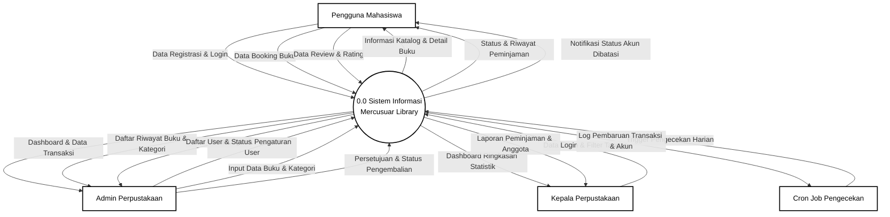

# DFD Level 0 (Diagram Konteks) - Mercusuar Library

Berikut adalah diagram konteks (Level 0) yang menggambarkan interaksi antara entitas luar dengan sistem sebagai satu kesatuan.

```mermaid
graph TD
    %% Styling (Hitam Putih / Monochrome)
    classDef proses fill:#FFFFFF,stroke:#000000,stroke-width:2px,color:#000000;
    classDef entitas fill:#FFFFFF,stroke:#000000,stroke-width:2px,color:#000000;

    %% Nodes
    User[Pengguna Mahasiswa]:::entitas
    Admin[Admin Perpustakaan]:::entitas
    KepalaPerpus[Kepala Perpustakaan]:::entitas
    Scheduler[Cron Job Pengecekan]:::entitas
    P0((0.0 Sistem Informasi<br>Mercusuar Library)):::proses

    %% Flows
    User -- "Data Registrasi & Login" --> P0
    User -- "Data Booking Buku" --> P0
    User -- "Data Review & Rating" --> P0
    P0 -- "Informasi Katalog & Detail Buku" --> User
    P0 -- "Status & Riwayat Peminjaman" --> User
    P0 -- "Notifikasi Status Akun Dibatasi" --> User

    Admin -- "Data Login & Pengaturan User" --> P0
    Admin -- "Input Data Buku & Kategori" --> P0
    Admin -- "Persetujuan & Status Pengembalian" --> P0
    P0 -- "Dashboard & Data Transaksi" --> Admin
    P0 -- "Daftar Riwayat Buku & Kategori" --> Admin
    P0 -- "Daftar User & Status" --> Admin

    KepalaPerpus -- "Data Login & Filter Tanggal" --> P0
    P0 -- "Dashboard Ringkasan Statistik" --> KepalaPerpus
    P0 -- "Laporan Peminjaman & Anggota" --> KepalaPerpus

    Scheduler -- "Trigger Pengecekan Harian" --> P0
    P0 -- "Log Pembaruan Transaksi & Akun" --> Scheduler
```
