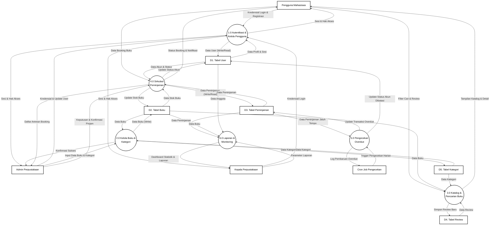

# DFD Level 1 (Diagram Utama) - Mercusuar Library

Berikut adalah diagram utama (Level 1) yang disederhanakan dengan mendekomposisikan alur proses yang detail ke diagram Level 2. Diagram ini berfokus pada interaksi tingkat tinggi antara entitas, proses utama, dan data store.

