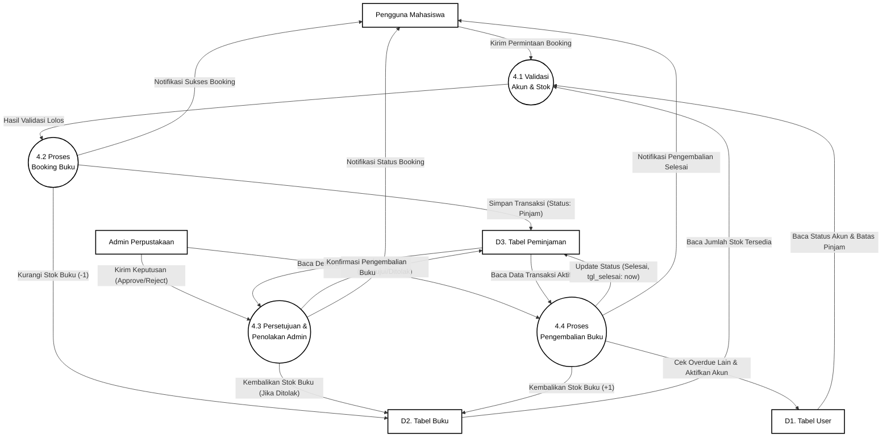
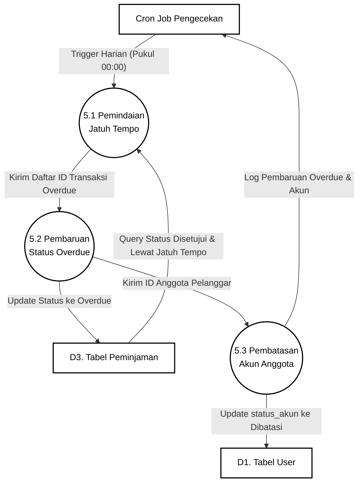

# DFD Level 2 (Rincian Proses Kompleks) - Mercusuar Library

Dokumen ini berisi rincian Level 2 untuk dua proses paling kompleks di sistem: **Proses 4.0 (Sirkulasi Peminjaman)** dan **Proses 5.0 (Pengecekan Overdue)**.

---

## 1. DFD Level 2A: Rincian Proses 4.0 (Sirkulasi Peminjaman)

Menggambarkan alur mulai dari validasi booking oleh user, persetujuan admin, hingga pengembalian buku.

---

## 2. DFD Level 2B: Rincian Proses 5.0 (Pengecekan Overdue)

Menggambarkan alur scheduler otomatis mengecek keterlambatan buku harian dan membatasi akun.

