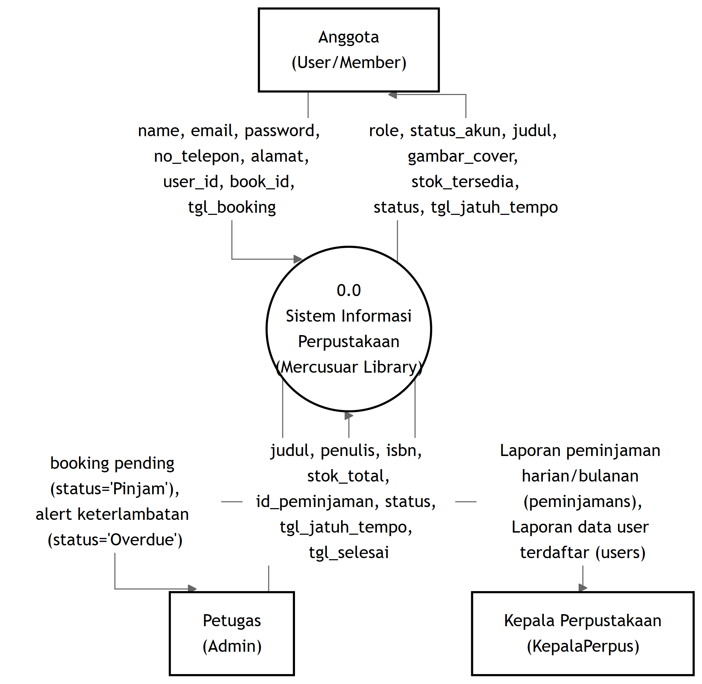
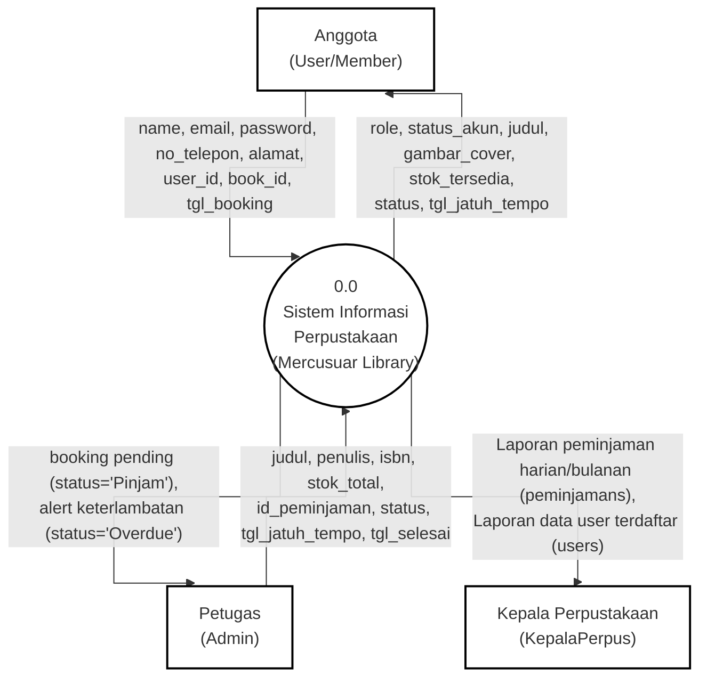
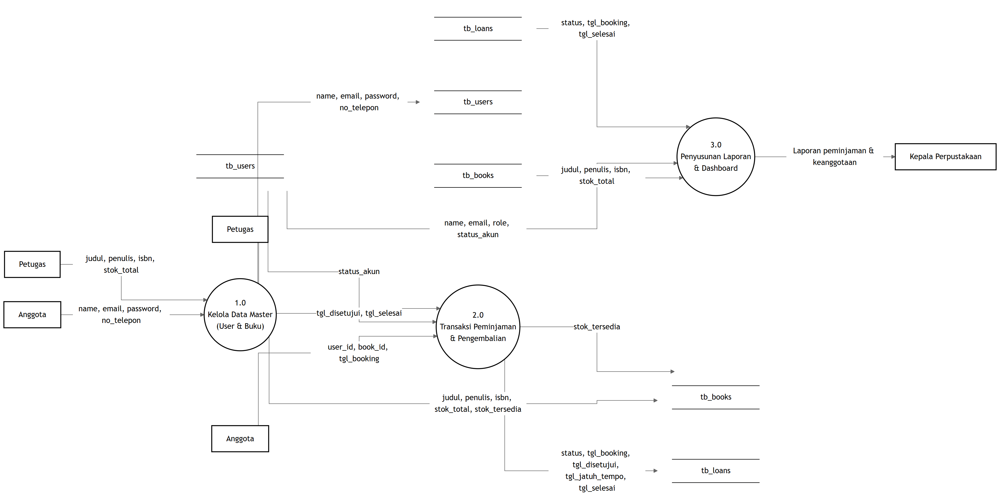
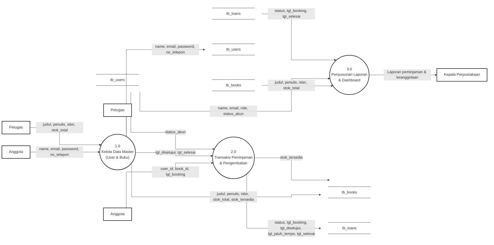
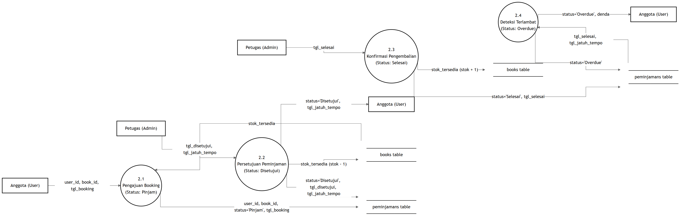
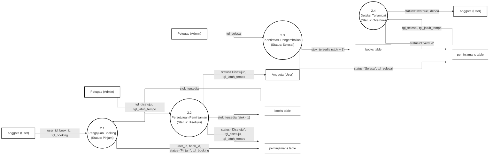

# Dokumentasi Alur Data Flow Diagram (DFD) - Mercusuar Library

Dokumen ini berisi rancangan alur data menggunakan **Data Flow Diagram (DFD)** Level 0 (Context Diagram), Level 1, dan Level 2 yang diimplementasikan menggunakan **Mermaid**. Rancangan ini disesuaikan dengan arsitektur sistem informasi perpustakaan **Mercusuar Library** dengan aturan visual hitam-putih (monochrome), jalur alur **tegak lurus/orthogonal (tanpa kelokan melengkung atau diagonal)**, serta bentuk simbol yang sesuai standar:
*   **External Entity:** Kotak/Persegi panjang (`[Nama]`).
*   **Process:** Lingkaran/Oval (`((Nama))`).
*   **Data Store:** Dua garis sejajar (`label` dengan garis unicode `───────`).
*   **Data Flow:** Panah lurus orthogonal (`-->`).

---

## 1. Pemetaan Simbol DFD ke Mermaid

Pemetaan elemen DFD ke kode Mermaid menggunakan class styling khusus hitam-putih flat:

| Elemen DFD | Deskripsi | Representasi Mermaid | Contoh Kode |
| :--- | :--- | :--- | :--- |
| **External Entity** | Entitas luar yang mengirim atau menerima data | Kotak hitam-putih tajam | `Anggota["Nama"]:::entity` |
| **Process** | Proses pengolahan data | Lingkaran sempurna | `Sistem(("Nama")):::process` |
| **Data Store** | Tempat penyimpanan data (Database/File) | Dua garis horizontal sejajar | `D1["────────── Nama ──────────"]` + `style D1 fill:none,stroke:none` |
| **Data Flow** | Arah aliran data | Panah lurus orthogonal | `A --> B` |

---

## 2. DFD Level 0 (Context Diagram)

Context Diagram mendefinisikan batas sistem secara garis besar, menggambarkan alur keluar masuknya data secara langsung (tanpa template kata "Kirim"/"Terima") antara sistem tunggal **Sistem Informasi Perpustakaan** dengan tiga entitas eksternal.

### Gambar Diagram DFD Level 0

### Kode Mermaid - DFD Level 0

---

## 3. DFD Level 1 (Dekomposisi Sistem)

Level 1 memecah proses utama menjadi tiga modul fungsional utama dengan mengintegrasikan penyimpanan data (data store) yang direpresentasikan dengan garis sejajar horizontal. Garis alur ditata tegak lurus dengan visual yang rapi.

### Gambar Diagram DFD Level 1

### Kode Mermaid - DFD Level 1

---

## 4. DFD Level 2 (Detail Transaksi)

Level 2 memecah **Process 2.0 (Transaksi Peminjaman & Pengembalian)** menjadi 4 sub-proses spesifik yang menggambarkan alur penulisan, pembacaan, dan pembaruan field database. Proses digambar secara linier dari kiri ke kanan (2.1 -> 2.2 -> 2.3 -> 2.4) untuk visualisasi yang rapi dan teratur dengan garis tegak lurus.

### Gambar Diagram DFD Level 2

### Kode Mermaid - DFD Level 2

